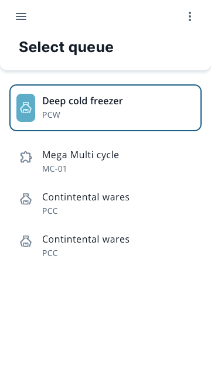

# Coding assignment

## Overview

Astro WMS® handles outbound flows in a warehouse by utilizing assignment queues. Each queue contains set of specific assignments (grouped by business rules) sorted by their priority. 

Your assignment is to create simple SPA, which displays a single page with list of picking queues.

## Technical requirements

Application needs to based on two libraries:
* [React](https://reactjs.org/) 
* [Material UI](https://mui.com/)

You must use [TypeScript](https://www.typescriptlang.org/).

## Other technical notes

Wrapper used around React (such as create-react-app, react-app-rewired, vite etc.) is not relevant in the assignment. Pick library of your choice.

Data displayed in the application can be hard-coded.

Prior solution presentation source code of the application should be published on GitHub, where it can be reviewed. It should be possible to clone repository and start the application on any machine after installing necessary dependencies. 

All components used in the application **need to be based on Material UI components** and they need to be styled correctly.

You should not aim for being 100% pixel perfect since you're given only a single mock image in form of PNG file without any meta-data, however implementation should be as close to the mock as possible given these resources.

## Styling

* Toolbar elevation level: 4
* Toolbar bottom radius: 12px
* Active item border: #1D5F83
* Active item icon background: #5DABC7
* Active item border radius: 12px

## Functional requirements

Application should display a single page with list of picking queues. By default the first item in the list should be set as 'active'. It should be possible to change change active item by clicking any item in the list.

## Testing

After the functionality is implemented please cover it with tests you find relevant. These can be unit tests, integration tests, component tests, E2E tests etc. - pick the approach, which in your opinion and experience makes the most sense given the functional requirements above.

## Reasoning behind the assignment

The aim of this task is to see:
* How you work with external libraries, where it's necessary to work with external documentation
* How you approach the problem of creating re-usable components, their interfaces etc.
* How you work with components styling
* How you work with automated tests
* General code organization

Good luck!